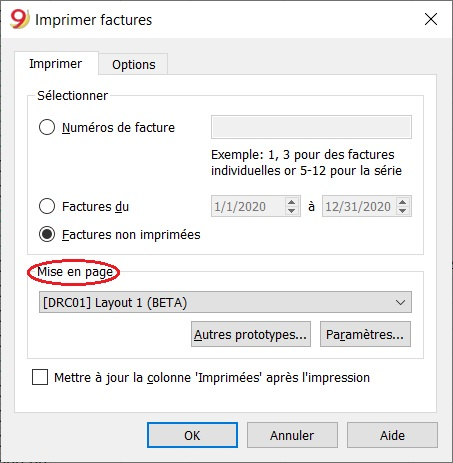
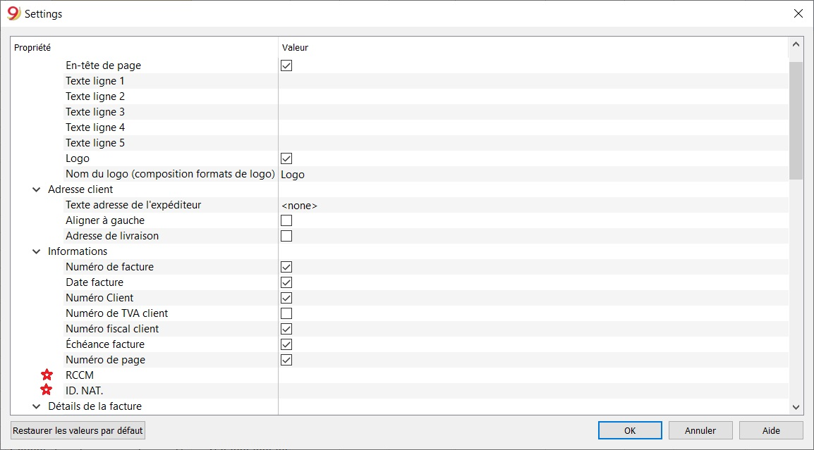
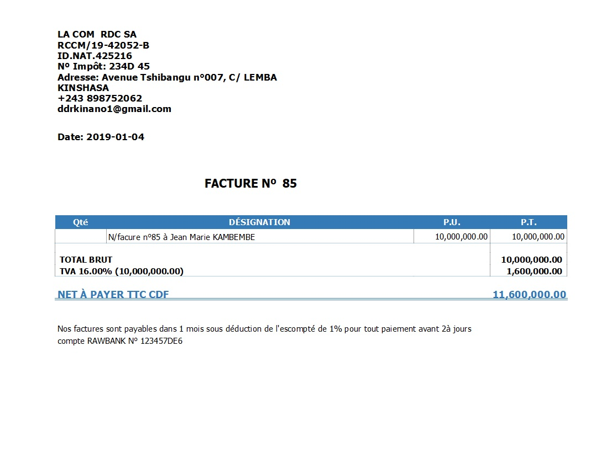

## Facuration avec le modèle de la République Démocratique du Congo

Avec la facturation de Banana Comptabilité, vous pouvez facilement créer et imprimer des factures, grâce à une série de mises en page prédéfinies et personnalisables adaptées à chaque pays.
Pour créer une facture, il faut créer un fichier comptable. Si vous en avez déjà un pour votre comptabilité, vous pouvez choisir de créer des factures dans votre fichier comptable existant ou d'en créer un nouveau uniquement pour la gestion des factures.

Pour créer des factures, [des configurations spécifiques doivent être définies dans le fichier de comptabilité](https://www.banana.ch/doc9/fr/node/9635).

Les étapes pour créer des factures sont les suivantes :

- [Configurez votre fichier comptable pour la facturation](https://www.banana.ch/doc9/fr/node/9635)
- [Ajoutez des comptes clients avec adresses](http://www.banana.ch/doc9/fr/node/9635#imposta_conti_clienti)
- [Saisissez des données pour les factures](https://www.banana.ch/doc/fr/node/9456)
- [Imprimez les factures](https://www.banana.ch/doc/fr/node/8295)

Pour de plus amples détails sur la facturation dans Banana Comptabilité, référez-vous à la [documentation Banana](https://www.banana.ch/doc/fr/node/8294).

## Imprimer la facture

La fenêtre de dialogue Imprimer factures est accessible à partir de la commande  Compta2 -> Clients -> Imprimer factures.

Dans la section **Mise en page**, choisir, le modèle de facture de la RDC, ensuite ajouter des détails de la société en cliquant sur **Paramètres**.

Configurer le numéro d'enregistrement de la société au Registre de Commerce et du Crédit Mobilier (**RCCM**).

Configurer l'identité nationale de la société (**ID. NAT.**).

Configurer les autres détails selon vos besoins.

Une fois que vous avez choisi les options d'impression, appuyez sur le bouton OK pour prévisualiser la facture.

