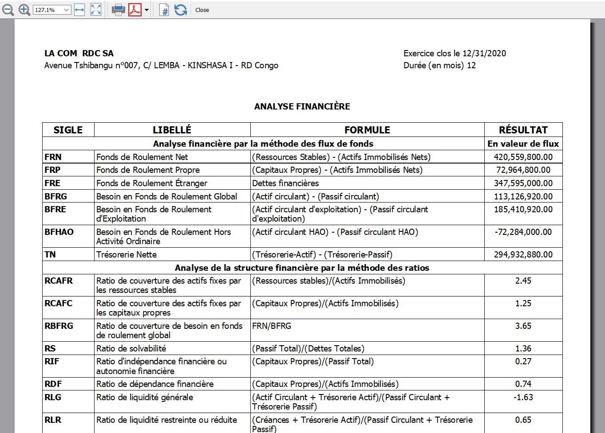

# Analyse Financière

L'App Banana [Analyse Financière (OHADA - RDC)](https://www.banana.ch/apps/fr/node/9406) crée un rapport d'analyse financière.

L'application a été développée en suivant la documentation OHADA:
* [Documentation sur l'analyse financière]()

Dans la documentation, la syntaxe utilisée pour spécifier les données à utiliser est **{compte/groupe,colonne}**, où:
* **compte/groupe**: indique le compte ou le groupe du tableau Comptes dans Banana (les groupes commencent avec **Gr=**) ;
* **colonne**: indique le type de données (Ouverture, Débit, Crédit, Total(débit-crédit)) du tableau Comptes dans Banana ;
* **(-1)**: indique que la valeur doit être inversée. Si positif, inverse à une valeur négative, si négatif, inverse à une valeur positive.

Fichier Javascript :
* [Fichier Javascript Analyse Financière](https://raw.githubusercontent.com/BananaAccounting/CongoRDC/master/reports/financial_analysis/ch.banana.africa.financialanalysisrdc.js)

## Configuration fichier Banana Comptabilité
Dans Banana, sélectionnez dans le menu **Fichier** la commande **Propriétés...**
### Adresse
* Sélectionnez la section **Adresse**
* Insérez le **nom de la société** dans le champ Société
* Insérez l' **Adresse** dans le champ Adresse

Les données insérées seront utilisées pour remplir l'en-tête du rapport.

## Comment cela fonctionne?

### Installer le BananaApp:
* Démarrer Banana Comptabilité.
* Installer le BananaApp **Analyse Financière OHADA et RDC**. 

### Exécuter le BananaApp:
* Ouvrez votre fichier de comptabilité avec Banana.
* Dans Banana, sélectionnez de **menu Apps** le BananaApp **Analyse Financière OHADA et RDC**
* Sélectionnez la période de comptabilité
* Cliquez sur **OK** pour générer le rapport
* Contrôler le résultat.

Exemple du rapport
