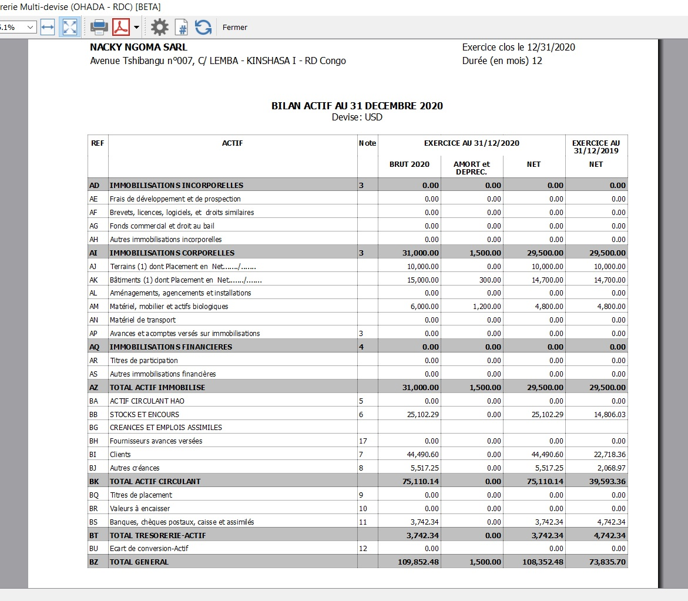
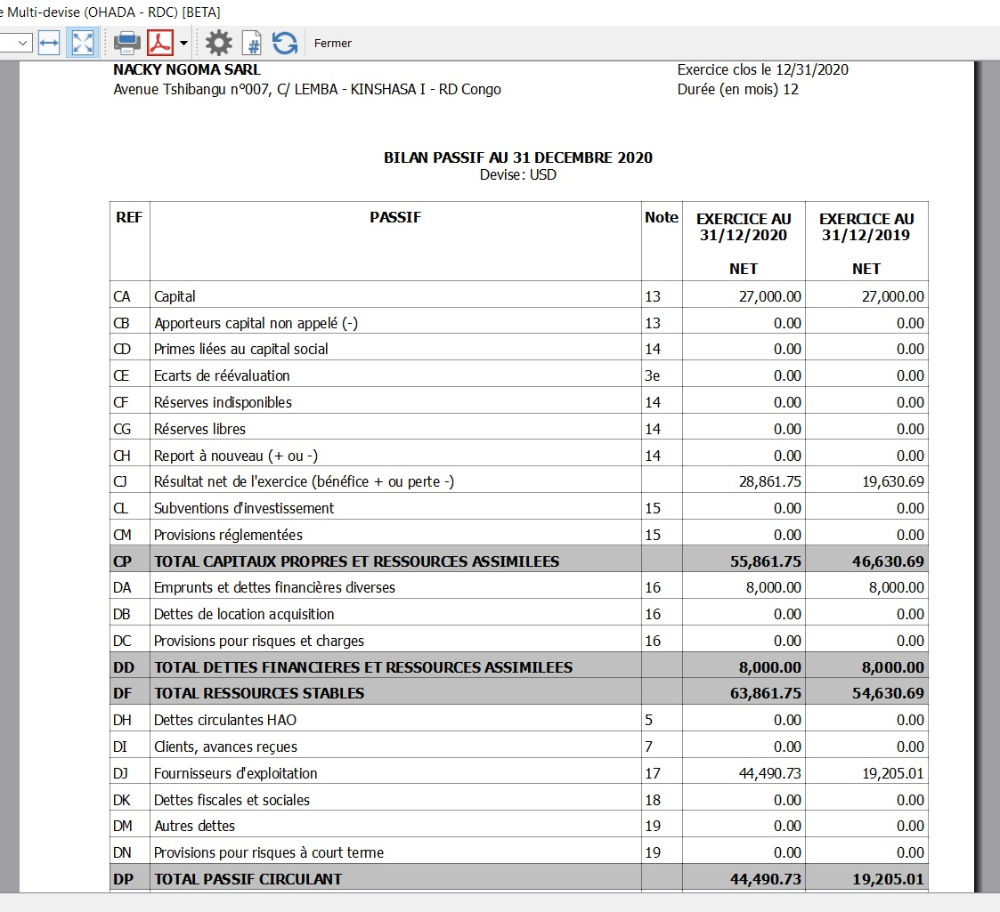
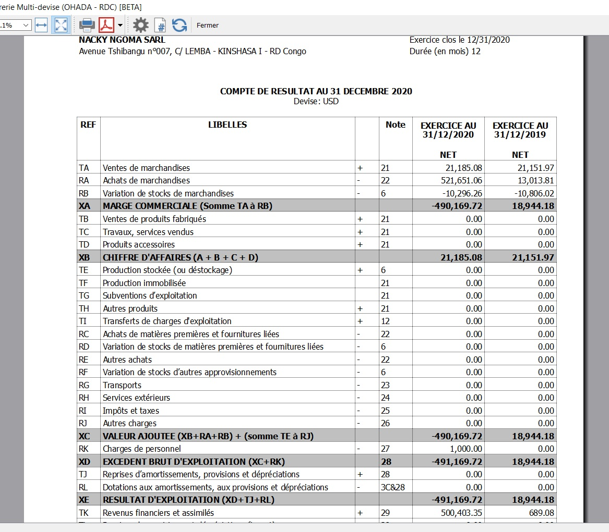
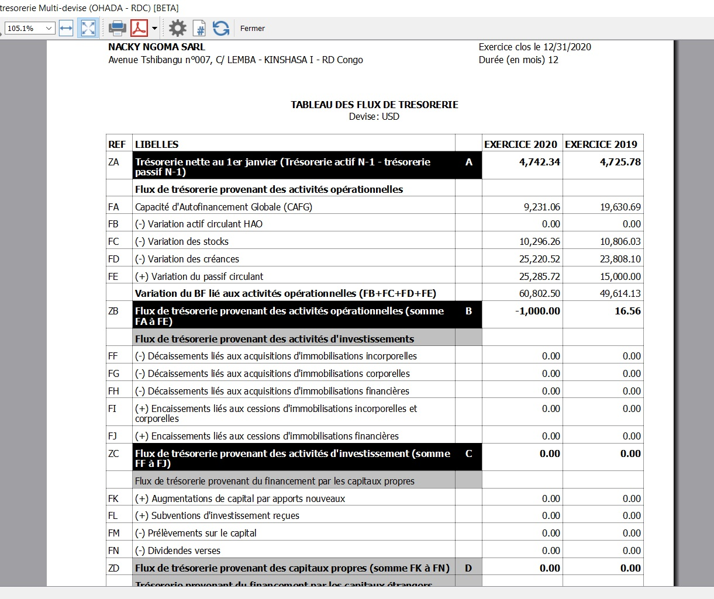

# Rapports comptables pour OHADA-RDC

L'App Banana [Rapports comptables OHADA et Congo RDC](https://www.banana.ch/apps/fr/node/9093) crée un rapport avec les trois documents suivants en mono et multi-devise:
* Bilan
* Compte de Résultat 
* Flux de Trésorerie

L'application a été développée en suivant les documentations spécifiques OHADA-RDC :
* [Documentation concernant le Bilan](https://github.com/BananaAccounting/CongoRDC/blob/master/reports/statements/balancesheet/balancesheet_documentation.pdf)
* [Documentation concernant le Compte de Résultat](https://github.com/BananaAccounting/CongoRDC/blob/master/reports/statements/profitlossstatement/profitlosstatement_documentation.pdf)
* [Documentation concernant le Flux de Trésorerie](https://github.com/BananaAccounting/CongoRDC/blob/master/reports/statements/cashflow/cashflow_documentation.pdf)

Dans la documentation, la syntaxe utilisée pour spécifier les données à utiliser est **{compte/groupe,colonne}**, où:
* **compte/groupe**: indique le compte ou le groupe du tableau Comptes dans Banana (les groupes commencent avec **Gr=**) ;
* **colonne**: indique le type de données (Ouverture, Débit, Crédit, Total(débit-crédit)) du tableau Comptes dans Banana ;
* **(-1)**: indique que la valeur doit être inversée. Si positif, inverse à une valeur négative, si négatif, inverse à une valeur positive.

Fichiers JavaScript :
* [Fichier JavaScript Bilan](https://raw.githubusercontent.com/BananaAccounting/CongoRDC/master/reports/statements/balancesheet/ch.banana.africa.balancesheetrdc.js)
* [Fichier JavaScript Compte de Résultat](https://raw.githubusercontent.com/BananaAccounting/CongoRDC/master/reports/statements/profitlossstatement/ch.banana.africa.profitlossstatementrdc.js)
* [Fichier JavaScript Flux de Trésorerie](https://raw.githubusercontent.com/BananaAccounting/CongoRDC/master/reports/statements/cashflow/ch.banana.africa.cashflowrdc.js)

## Configurations fichier Banana Comptabilité
Dans Banana sélectionnez dans le menu **Fichier** la commande **Propriétés...**
### Adresse
* Sélectionnez la section **Adresse**.
* Insérez le **nom de la société** dans le champ Société.
* Insérez le **Désignation du numéro de l'entité** dans le champ Numéro fiscal.
* Insérez le **Numéro d'identification** dans le champ Numéro de TVA.

Les données insérées seront utilisées pour remplir l'en-tête du rapport.

### Options
* Sélectionnez la section **Options**.
* Insérez le **fichier de l'année précédente**. 

Le fichier de l'année précédente n'est utilisé que pour le rapport des flux de trésorerie.
Il est facultatif : si le fichier de l'année précédente est sélectionné, il est utilisé pour calculer puis insérer dans le rapport les données dans la colonne EXERCICE N-1. Si aucun fichier n'est sélectionné, la colonne EXERCICE N-1 sera vide.

## Comment cela fonctionne

### Installer le BananaApp:
* Démarrer Banana Comptabilité.
* Installer le BananaApp **Rapports Comptables OHADA et Congo RDC**. Consulter la documentation [Menu Apps](https://www.banana.ch/doc/fr/node/4702).

### Exécuter le BananaApp:
* Ouvrez votre fichier de comptabilité avec Banana.
* Dans Banana, sélectionnez de menu **Extensions** l'extension **Rapports Comptables OHADA et Congo RDC** ensuite choisissez **Bilan, Compte de Résultat, Flux de Trésorerie Mono-devise** ou **Bilan, Compte de Résultat, Flux de Trésorerie Multi-devise** selon le besoin.
* Contrôler le résultat.

- Exemple mono-devise

Rapport Bilan Actif

 

Rapport Bilan Passif

 

Rapport Compte de Résultat

 

Rapport Flux de Trésorerie 

 
 

Exemple multi-devise

Rapport Bilan Actif

 

Rapport Bilan Passif

 

Rapport Compte de Résultat

 

Rapport Flux de Trésorerie

