# Déclaration de la Taxe sur la Valeur Ajoutée (TVA) et État Détaillé des Déductions de TVA

L'App Banana [Taxe sur la valeur ajoutée TVA OHADA et Congo RDC](https://www.banana.ch/apps/fr/node/9405) génère automatiquement la déclaration de la TVA et l'état détaillé des déductions de TVA pour les services des impôts de la République Démocratique du Congo.

En utilisant un outil comme Banana Comptabilité (135$ HT, pour une license à vie), le processus de calcul de la TVA est simplifié.

L'application a été développée en suivant les modèles de déclaration de la TVA et de l'état détaillé des déductions de TVA de la Direction Générale des Impôts (DGI) en RDC:
* [Modèle de déclaration de la TVA](tvareportrdc/references/DECLARATION%20TVA%20NOUVEAU%20MODELE.pdf)
* [État détaillé des déductions de TVA](etat_detaille_deduction_tva/references/Etat_detaillee_des_deductions_de_tva.pdf)

Fichier Javascript:
* [Fichier Déclaration de TVA Congo](tvareportrdc/ch.banana.africa.tvareportrdc.js)
* [Fichier État détaillé des déductions de TVA](etat_detaille_deduction_tva/ch.banana.africa.deductiontvardc.js)

## Comment cela fonctionne?

### Installer le BananaApp:
* Démarrer Banana Comptabilité.
* Installer l'extension Banana **Taxe sur la valeur ajoutée TVA OHADA et Congo RDC**. 

Pour installer l'extension Banana **Taxe sur la valeur ajoutée TVA OHADA et Congo RDC**:
- Cliquer sur **Extensions**
- Ensuite **Gérer extensions...**

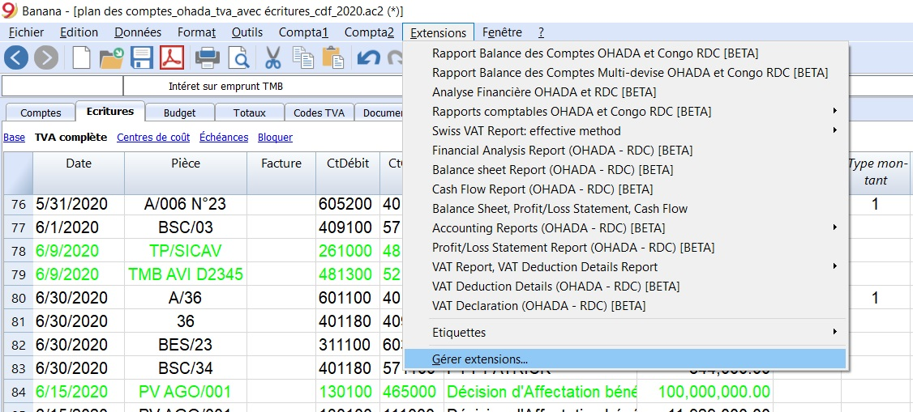

Une fenêtre s'ouvre et affiche toutes les extensions Banana.

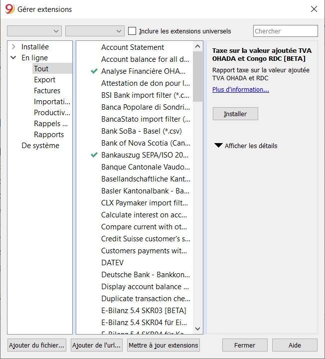

Dans la barre de recherche, taper "taxe" et le résultat qui s'affiche est celui de l'extension de la TVA RDC.

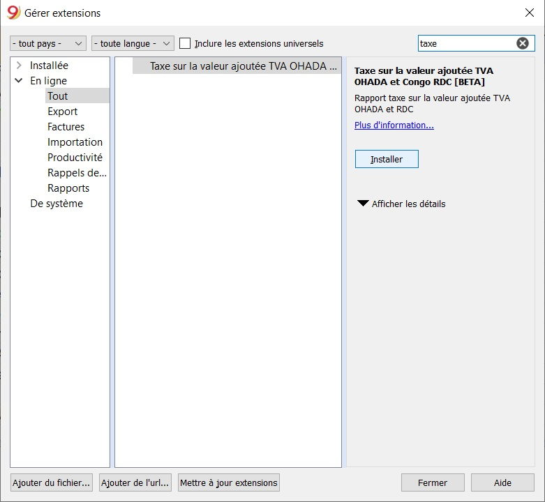

Cliquer sur **Installer** pour installer l'extension dans Banana Comptabilité.

Une fenêtre de dialogue s'affiche. Cliquer sur **OK** pour démarrer l'installation de l'extension.

Vérifier que l'installation a réussi en cliquant sur **Installée**

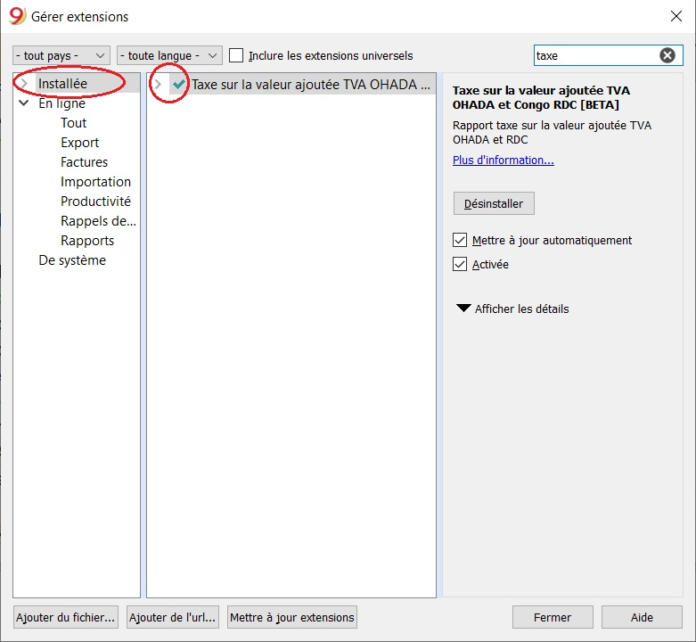

Cliquer sur **Fermer** pour fermer la fenêtre.

## Configuration fichier Banana Comptabilité
Dans Banana, sélectionnez dans le menu **Fichier** la commande **Propriétés fichier...**

### Comptabilité
* Remplissez les champs dans l'onglet de **Comptabilité**

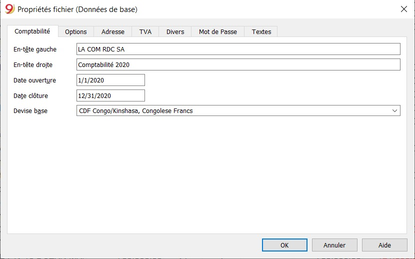

### Adresse
Sélectionnez la section **Adresse**
* Insérez le nom de la **société** dans le champ **Société**
* Insérez l' **adresse** dans le champ **Adresse 1**
* Insérez le **code postal** dans le champ **Code postal**  
* Insérez la **ville** dans le champ **Ville**
* Insérez la **province** dans le champ **Région**
* Insérez le **pays** dans le champ **Pays**
* Insérez le **numéro de téléphone** dans le champ **Téléphone**
* Insérez l' **email** dans le champ **Email**
* Insérez le **numéro d'impôt** dans le champ **Numéro Fiscal**

En voici une illustration.

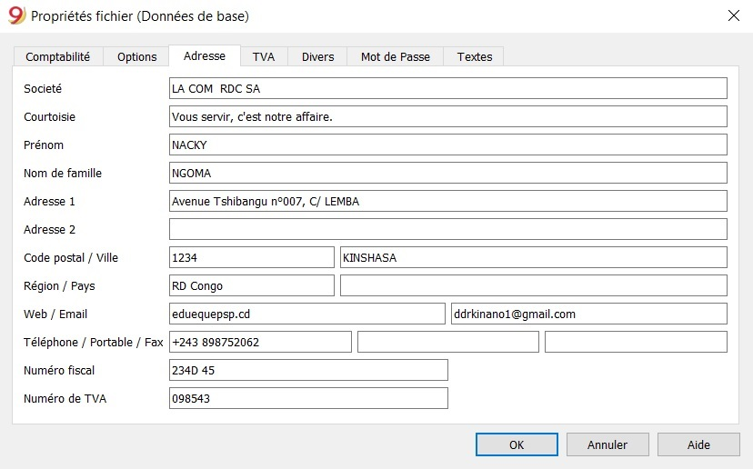

Les données insérées seront utilisées pour remplir la partie **IDENTIFICATION DU REDEVABLE** dans le formulaire de déclaration de la TVA et de l'état détaillé des déductions de TVA.

### Plan de compte

Le plan des compte est paramétré pour le bilan, le compte de résultat et le tableau de flux de trésorerie

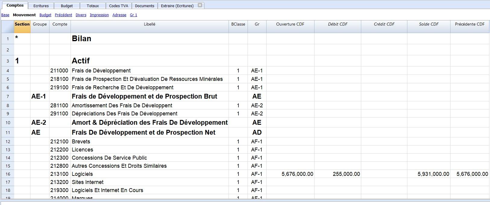

### Codes TVA

La table des codes TVA sont essentiels pour générer automatiquement la déclaration de la TVA et l'état détaillé des déductions de TVA. Cette table contient toutes les informations nécessaires pour calculer les montants de TVA à payer et récupérables. Pour plus de détails, visitez ce lien ...

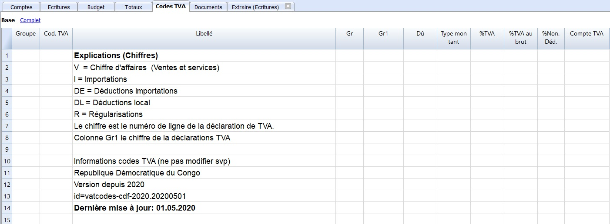
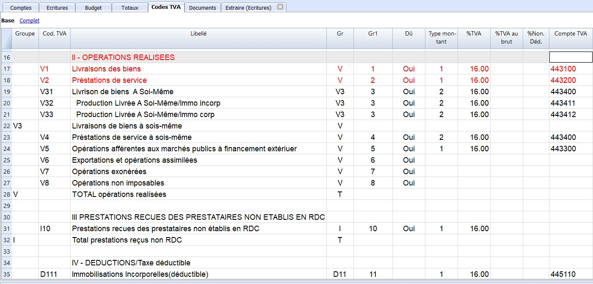

### Tableau des écritures

Toutes les écritures sont enregistrées dans ce tableau. Pour générer automatiquement la déclaration de la TVA et l'état détaillé des déductions de TVA, il suffit d'activer le code TVA.

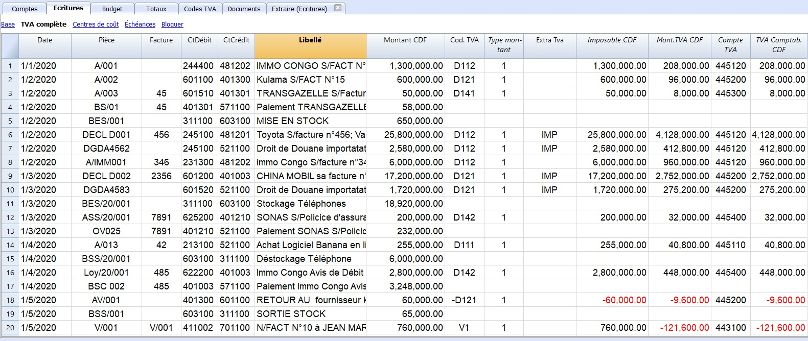

- **Date:** la date est utilisée par le programme pour attribuer l'écriture à une certaine période. La date devrait être dans les limites de la période de comptabilité.

- **Pièce:** le code de la pièce qui sert de base pour l'écriture comptable. Il est préférable d'introduire un nombre progressif de la pièce pour qu'elle soit facilement traçable à partir des écritures.

- **Facture:** il est possible d'insérer un numéro de facture pour classifier les écritures. Ceci permet aussi de générer automatiquement des factures pour chaque écriture.

- **CtDébit:** le compte qui sera débité.

- **CtCrédit:** le compte qui sera crédité.

- **Libellé:** la description de l'écriture.

- **Montant CDF:** le montant qui sera introduit au compte débiteur et créditeur.

- **Cod. TVA:** pour chaque écriture avec TVA, il faut introduire un des codes TVA du tableau des codes TVA.

- **Type montant:** ce code indique comment le logiciel considère le montant de l'écriture.

1. 0 (ou cellule vide)avec TVA, le montant de l'écriture inclut la TVA
2. 1 = sans TVA, le montant de l'écriture n'inclut pas la TVA
3. 2 = montant TVA, le montant de l'écriture est considéré comme le montant de la TVA à 100%.
4. Ce n'est pas modifiable.

- **Extra Tva:** le code indiquant une information supplémentaire sur un code TVA pour désigner par exemple, une écriture concernant l'importation.  IMP = Importations

- **Imposable CDF:** le montant sur lequel on prélève la TVA.

- **Mont.TVA CDF:** le montant de la TVA (16% du montant imposable)

- **Compte TVA:** le compte TVA concernant l'écriture.

- **TVA Comptab. CDF:** le montant de la TVA comptabilisé.

### Exécuter l'extension:
* Ouvrez votre fichier de comptabilité avec Banana.
* Dans Banana, sélectionnez de **Extensions** l'extension **Taxe sur la valeur ajoutée TVA OHADA et Congo RDC** ensuite **Déclaration de la TVA, Etat détaillé des déductions de la TVA**.
* Sélectionnez le mois pour lequel on veut déclarer la TVA
* Cliquez sur **OK** pour générer automatiquement la déclaration 
* Copier les résultats sur les formulaires originaux de la DGI.

Exemple de déclaration de la TVA RDC
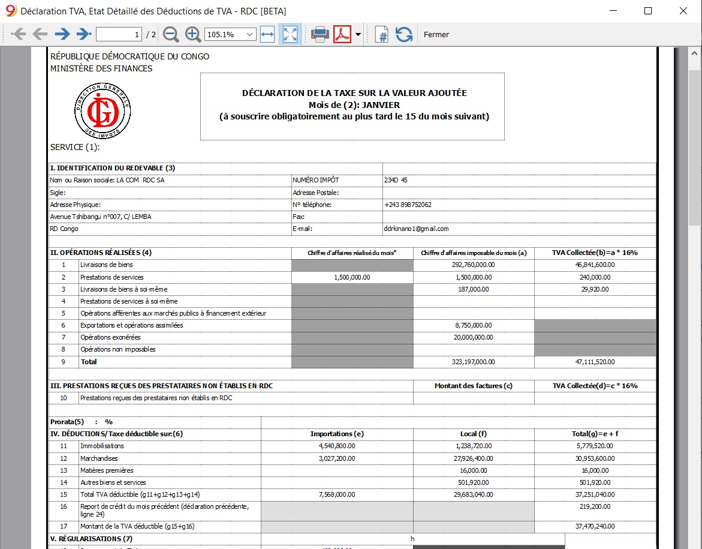

Exemple de l'état détaillé des déductions de TVA

