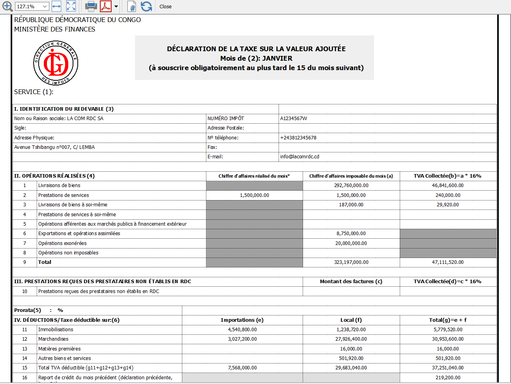

# Déclaration de la Taxe sur la Valeur Ajoutée (TVA)

L'App Banana [Taxe sur la valeur ajoutée TVA OHADA et Congo RDC](https://www.banana.ch/apps/fr/node/9405) génère automatiquement la déclaration de la TVA pour les services des impôts de la République Démocratique du Congo.

L'application a été développée en suivant le modèle de déclaration de la Direction Générale des Impôts (DGI) en RDC:
* [Modèle de déclaration de la TVA](https://github.com/BananaAccounting/CongoRDC/blob/master/reports/tva/tva-2020/references/DECLARATION%20TVA%20NOUVEAU%20MODELE.pdf)

Fichier Javascript:
* [Fichier Déclaration de TVA Congo](https://raw.githubusercontent.com/BananaAccounting/CongoRDC/master/reports/tva/tva-2020/ch.banana.africa.tvardc.js)

## Configuration fichier Banana Comptabilité
Dans Banana, sélectionnez dans le menu **Fichier** la commande **Propriétés...**
### Adresse
* Sélectionnez la section **Adresse**
* Insérez le **nom de la société** dans le champ Société
* Insérez l' **adresse** dans le champ Adresse
* Insérez la **province** dans le champ Etat
* Insérez le **numéro de téléphone** dans le champ Téléphone
* Insérez le **numéro d'impôt** dans le champ Numéro Fiscal
* Insérez l' **email** dans le champ Email

Les données insérées seront utilisées pour remplir la partie IDENTIFICATION DU REDEVABLE dans le formulaire de déclaration de la TVA.

## Comment cela fonctionne?

### Installer le BananaApp:
* Démarrer Banana Comptabilité.
* Installer le BananaApp **Taxe sur la valeur ajoutée TVA OHADA et Congo RDC**. 

### Exécuter le BananaApp:
* Ouvrez votre fichier de comptabilité avec Banana.
* Dans Banana, sélectionnez de **menu Apps** le BananaApp **Taxe sur la valeur ajoutée TVA OHADA et Congo RDC** ensuite **VAT Declaration (OHADA - RDC)**.
* Sélectionnez le mois pour lequel on veut déclarer la TVA
* Cliquez sur **OK** pour générer automatiquement la déclaration
* Copier les résultats sur un formulaire original de la DGI.

Exemple de déclaration de la TVA RDC

