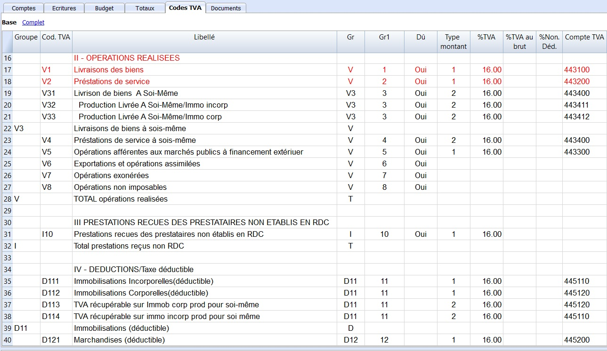
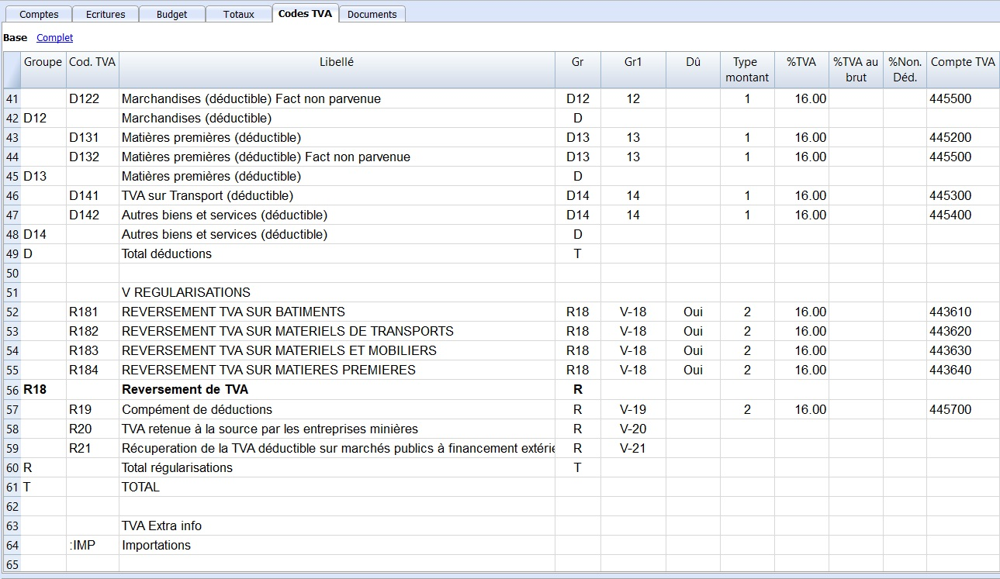

## Comprendre les codes TVA

La table des codes TVA contient tous les codes TVA paramétrés selon les besoins de la déclaration de la TVA en RDC, avec tous les cas nécessaires pour calculer correctement et générer automatiquement la déclaration de la TVA.

- Le code TVA est le code que vous introduisez lors de la passation des écritures. Le programme calcule automatiquement la TVA et l'enregistre dans le compte spécifié.

- Le pourcentage de la TVA est de 16% en RDC.

- **Livraisons des biens (V1) :** code utilisé pour calculer le chiffre d'affaires hors taxe et la TVA afférents aux livraisons de biens réalisés au cours du mois -> Compte TVA **443100**

- **Prestations de services (V2) :** code utilisé pour calculer le chiffre d'affaires hors taxe et la TVA afférents aux prestations de services encaissés au cours du mois -> Compte TVA **443200**

- **Livraisons de biens à soi-même (Groupe V3) :** code utilisé pour calculer le coût de revient des livraisons de biens à soi-même réalisées au cours du mois et la TVA correspondante -> Compte TVA **443400**

    - **V31 :** code utilisé pour calculer la TVA sur la livraison des biens à soi-même

    - **V32 :** code utilisé pour calculer la TVA sur la production livrée à soi-même (immobilisations incorporelles)

    - **V33 :** code utilisé pour calculer la TVA sur la production livrée à soi-même (immobilisations corporelles)

    Ces montants s'additionnent dans le groupe **V3**.

- **Prestations de services à soi-même (V4) :** code utilisé pour calculer le montant total des dépenses engagées au titre de prestations de services à soi-même réalisées au cours du mois et la TVA correspondante -> Compte TVA **443400**

- **Opérations afférentes aux marchés public à financement extérieur (V5) :** code utilisé pour calculer le chiffre d'affaires afférent aux opérations réalisées dans le cadre des marchés publics à financement extérieur et la TVA correspondante -> **443300**

- **Exportations et opérations assimilées (V6) :** code utilisé pour calculer uniquement le chiffre d'affaires afférent aux exportations et opérations assimilées aux exportations réalisées au cours du mois

- **Opérations exonérées (V7) :** code utilisé pour calculer uniquement le chiffre d'affaires afférent aux opérations non imposées à la TVA (exonérées) réalisées au cours du mois

- **Opérations non imposables (V8) :** code utilisé pour calculer uniquement le chiffre d'affaires afférent aux opérations non imposables à la TVA (hors champ d'application) réalisées au cours du mois

- **Prestations reçues des prestataires non établis en RDC (I10) :** code utilisé pour calculer le montant brut de la (des) facture(s) afférente(s) aux prestations de services reçues d'un prestataire non établi en RDC (cas de non désignation d'un représentant) et la TVA correspondante

- **Immobilisations (Groupe D11) :** 

    - **D111 :** code utilisé pour calculer la TVA déductible sur les immobilisations incorporelles -> Compte TVA **445110**

    - **D112 :** code utilisé pour calculer la TVA déductible sur les immobilisations corporelles -> Compte TVA **445120**

    - **D113 :** code utilisé pour calculer la TVA récupérable sur les immobilisations corporelles produites pour soi-même -> Compte TVA **445120**

    - **D114 :** code utilisé pour calculer la TVA récupérable sur les immobilisations incorporelles produites pour soi-même -> Compte TVA **445110**

    Tous ces montants s'additionnent dans le groupe **D11**. 

    Pour calculer le montant TVA des immobilisations importées, il faudrait activer le code **IMP** dans la colonne **Extra TVA**.

- **Marchandises (Groupe D12) :**

    - **D121 :** code utilisé pour calculer la TVA déductible sur les marchandises -> Compte TVA **445200**

    - **D122 :** code utilisé pour calculer la TVA déductible sur les marchandises (factures non parvenues) -> Compte TVA **445500**   

    Ces montants s'additionnent dans le groupe **D12**.
    
    Pour calculer le montant TVA des marchandises importées, il faudrait activer le code **IMP** dans la colonne **Extra TVA**.

- **Matières premières (Groupe D13) :**

    - **D131 :** code utilisé pour calculer la TVA déductible sur les matières premières -> Compte TVA **445200**

    - **D132 :** code utilisé pour calculer la TVA déductible sur les matières premières (factures non parvenues) -> Compte TVA **445500**

    Ces montants s'additionnent dans le groupe **D13**.

    Pour calculer le montant TVA des matières premières importées, il faudrait activer le code **IMP** dans la colonne **Extra TVA**.

- **Autres biens et services (Groupe D14) :**

    - **D141 :** code utilisé pour calculer la TVA déductible sur le transport -> Compte TVA **445300**

    - **D142 :** code utilisé pour calculer la TVA déductible sur les autres biens et services -> Compte TVA **445400**

    Ces montants s'additionnent dans le groupe **D14**.

    Pour calculer le montant TVA des autres biens et services importées, il faudrait activer le code **IMP** dans la colonne **Extra TVA**.

- **Reversement de TVA (Groupe R18) :** 

    - **R181 :** code utilisé pour calculer le reversement de la TVA sur bâtiments -> Compte TVA **443610**

    - **R182 :** code utilisé pour calculer le reversement de la TVA sur matériels de transport -> Compte TVA **443620**

    - **R183 :** code utilisé pour calculer le reversement de la TVA sur materiels et immobiliers -> Compte TVA **443630**

    - **R184 :** code utilisé pour calculer le reversement de la TVA sur matières premières -> Compte TVA **443640**

    Ces montants s'additionnent dans le groupe **R18**.

- **Complément de déductions (R19) :** code utilisé pour calculer le complément de déductions -> Compte TVA **445700**

- **TVA retenue à la source par les entreprises minières (R20) :** code utilisé pour calculer le montant de la TVA retenue à la source par les entreprises minières

- **Récupération de la TVA déductible sur marché publics à financement extérieur (R21) :** code utilisé pour calculer le montant récupérable de la TVA déductible sur marché publics à financement 

